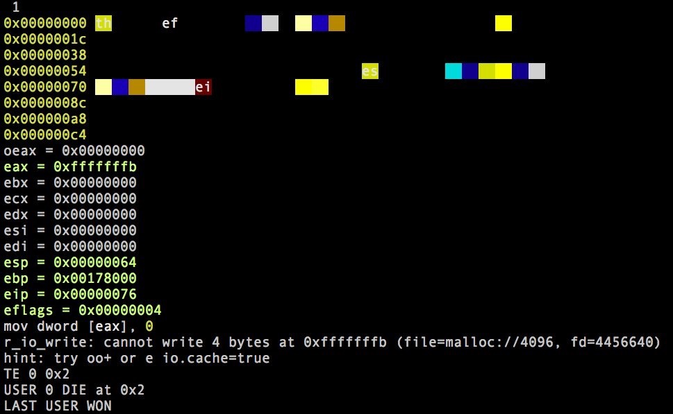

r2wars
======

r2wars is a game similar to `codewars` (or pMARS)

[asciinema demo](https://asciinema.org/a/0zu3d2hlriuhdup8uel4znjtr)

How it works
------------

codewar-style games are basically a competition between two programs to survive as much time as possible by sharing the memory space with other programs.

In codewars or pmars, the code you run is from a specific artificial architecture, the differences with r2wars are the following:

* Use any arch supported by ESIL
* More than 2 programs can run at the same time
* Cyclic execution cost matters for the turns

Two or more programs written in assembly for Z80, MIPS, ARM, X86, are assembled with rasm2 and then emulated using ESIL.

The program counter and stack pointers are initialized at random positions in a common shared memory address space for both programs.

The r2wars scheduler will execute one instruction of each program on each turn, skipping some turns to adjust to the cyclic cost of execution of the specific instruction.

The challenge
-------------

The programs must find in memory the other program and overwrite it in order to make it crash.

A crash happens when the program executes an invalid instruction or tries to read/write in a non-allocated address. Syscalls are ignored, but this may change after some discussion, as well as handling IO and catch unalignment memory accesses.

The memory where those programs run is assumed to be `rwx`.

Multiple techniques are used in order to achieve this:

Your program can try to protect itself by replicating itself on different places and jump there, but you can also use offensive techniques like the one in this example code that aims to identify where the other's program live and nullify its bytes

	call label
	label:
	  pop eax
	loop:
	  sub eax, 10
	  cmp [eax], 0
	je loop
	  mov [eax], 0
	  jmp loop

Side benefits
-------------

Despite of the main benefit of having fun competing with others just writing assembly code, r2wars aims to improve the support for more architectures, by supporting more instructions, better encodings, find and squash bugs in the assembler, enhance the emulation, identify problems in the ESIL emulation engine, etc..

References
----------

* http://www.koth.org/pmars/
